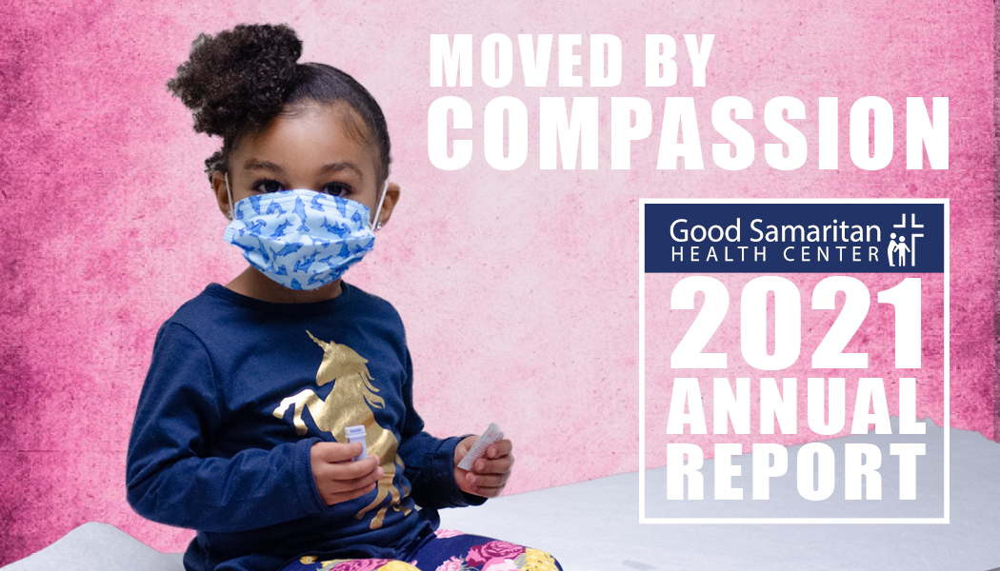
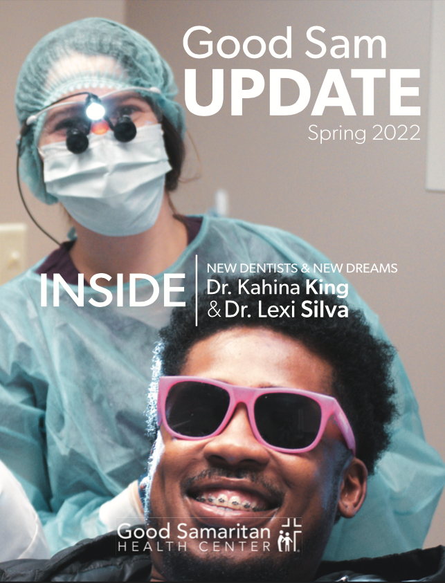
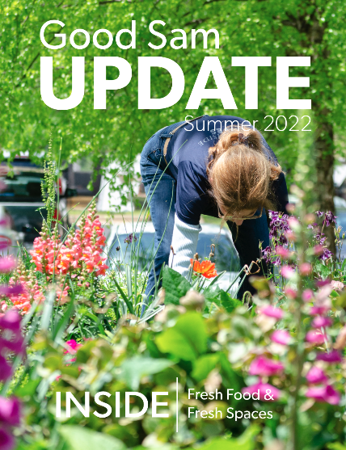

# Good Samaritan Health Center Portfolio

## Description
A collection of visually impactful updates and reports that use emotional appeal and census analytics to summarize patient, staff, and donor relationships at Good Samaritan Health Center. 

These projects showcase the work that I helped to complete in my role as a Marketing and Communications Coordinator. My primary responsibilities included designing layout, collecting patient/staff photos and stories, and working directly with Chief Development Officer for editorial recommendations and final approvals.

All rights and materials belong to Good Samaritan Health Center.

## Table of Contents
* [What is Good Sam?](#what-is-good-sam)
* [Technologies Used](#technologies-used)
* [Annual Impact Report](#annual-impact-report-2021)
* [Quarterly Update: Spring 2022](#quarterly-update-spring-2022)
* [Quarterly Update: Spring 2022](#quarterly-update-summer-2022)
* [License](#license)

## What is Good Sam?
[Good Samaritan Health Center](https://goodsamatlanta.org/) is a health center located on the West side of Atlanta who's mission is spreading Christ's love through quality healthcare to those in need. By providing a full circle of health that includes medical, dental, behavioral, nutrition/health education, and wellness services to the uninsured and under-insured Good Sam is helping to reverse the healthcare gap in the community and set families on a path to achieving long-term health.

To learn more about Good Samaritan Health Center visit their website at goodsamatlanta.org 

## Technologies Used
* Adobe InDesign
* Adobe Photoshop
* Adobe Lightroom

## Annual Impact Report 2021: 
[View Full PDF](https://goodsamatlanta.org/wp-content/uploads/2022/09/Annual-Impact-Report-2021-Website.pdf)

## Quarterly Update: Spring 2022
[View Full PDF](https://indd.adobe.com/view/81b9696a-2a5f-441a-b811-522be996a221)

## Quarterly Update: Summer 2022
[View Full PDF](https://indd.adobe.com/view/857c8cd8-c5df-4ed4-b00d-3ee8aa234f06)

## License
© 2022 The Good Samaritan Health Center, Inc.

All rights and materials belong to Good Samaritan Health Center.
